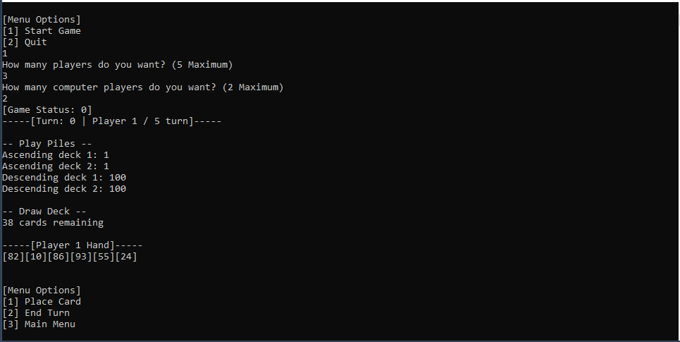

[Back](https://dhog10.github.io/portfolio/)

## C++
I began programming in C++ during the first year of my University course. The majority of my work in C++ so far has been projects related to my course. My grasp of C++ has improved during my studies, which has in turn helped my understanding of programming at a lower level than I was originally used to. My ability to debug code using break points in Visual Studio has also improved a lot after programming with C++.

### 2D Rasterizer (TinyRaster)
[Source](https://github.com/dhog10/TinyRaster)
(Majority of my implementations to skeleton code in Rasterizer.cpp)

For this assignment I was tasked to complete the implementation of skeleton code provided, my implementation should complete functions which would rasterize polygon coordinates and render 2D image representationt to the screen. This included lines, triangles, quads and concave polygons.

<video width="480" height="320" controls="controls">
  <source src="images/tinyraster.mp4" type="video/mp4">
</video>
Demonstration of different rasterization methods in action.

### TheGame console game
[Source] (https://github.com/dhog10/TheGameRework)

This project is an interactive console version of the board game "The Game". The game involves players trying to reach a score as close to 0 as possible. My implementation supports multiple human players, and AI players. This was my first C++ project and I developed my basic ability in the language significantly during this project.

TheGame during gameplay.
