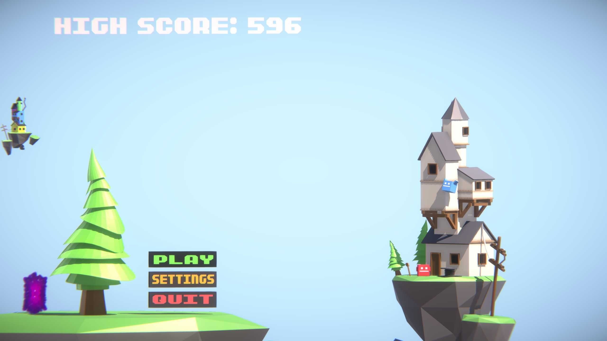
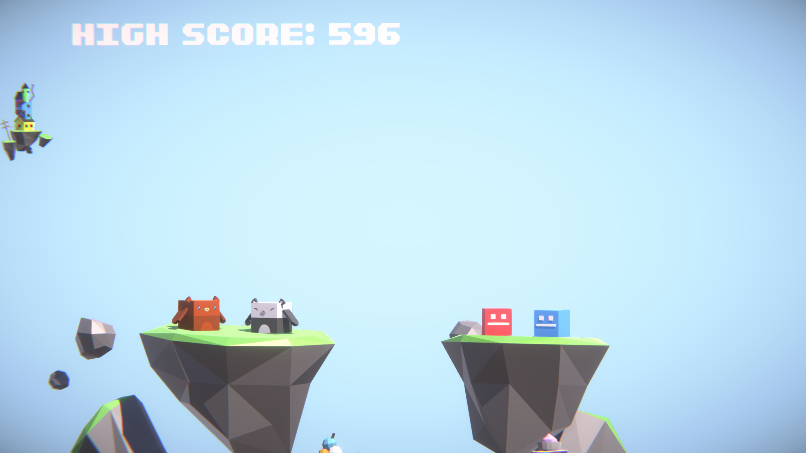
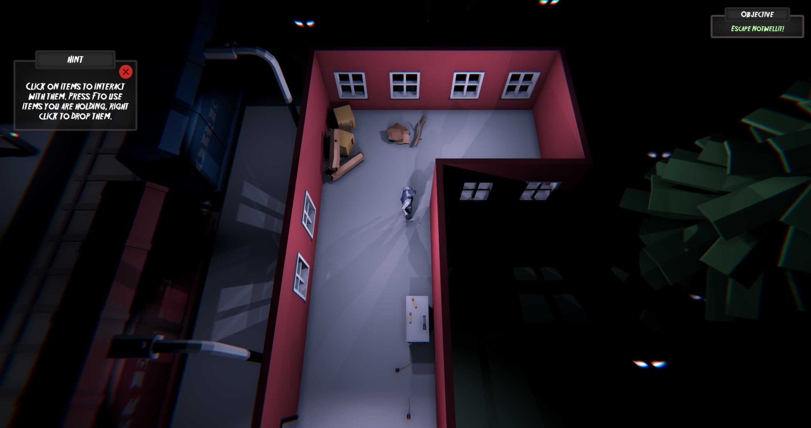
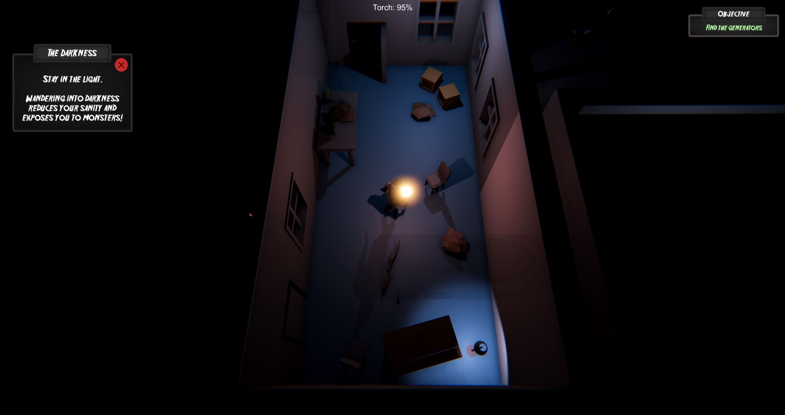

## Unity

I have worked on many Unity projects, unity is currently the engine I am most experienced with. I have worked on projects for university coursework and many more personal projects in my spare time. My experience in Unity has greatly improved my understanding of 3D mathematics and manipulation of objects in a 3D space, ability to develop gameplay mechanics such as player controllers, weapons, interactable and dynamic items such as doors, elevators and much more.

### Uniscention
[Game Build (May perform poorly, optimization not a focus of four day game jam)](https://github.com/dhog10/portfolio/blob/master/builds/Uniscention.zip)

Uniscention is a game I worked on during the first game jam of my second year in University. This game was developed in four and a half days in a team of four designers and two programmers. I took on the task of creating mechanics such as the player movement, camera movement, character selection, interactable items and 3D menu buttons. The feedback received from my peers and tutors was very positive for this project, and I am very pleased with the final product.

<video width="480" height="320" controls="controls">
  <source src="images/uniscention_player.mp4" type="video/mp4">
</video>

The player movement system in this game is very smooth, the player traverses adjacent to the face of the tower they are on, the player can also seamlessly move around faces by simply jumping around the cube or entering teleporters.

### Night in Notwellit
[Game Build (May perform poorly, optimization not a focus of four day game jam)](https://github.com/dhog10/portfolio/blob/master/builds/NightInNotwellit.zip)

Night in Notwellit is the second game I worked on for my University group project module. Again, this game was developed in four and a half days with a team of four designers and two programmers. For this game I took on the task of creating the player controller, interactable items, holdable items, inventory system, UI & crafting mechanics, procedural detail scattering, in engine setup of various prefabs, tooltips and objectives and enemy AI.

<video width="480" height="320" controls="controls">
  <source src="images/notwellit_player.mp4" type="video/mp4">
</video>
My player controller for this game features intuitive and easy movement, with suitable and comfortable camera angles.
<video width="480" height="320" controls="controls">
  <source src="images/notwellit_enemies.mp4" type="video/mp4">
</video>
The enemies in Notwellit would not be able to enter light, which means the player would have to stay in the light to survive.

### Multiplayer Test
Multiplayer test is a personal project I have recently been working on to improve my understanding of network structure used in Unity, and my ability to setup game mechanics such as weapons and player controllers which function over a network. This project was creating over a period of roughly a week. I also improved my understanding of animations, blend trees and IK techniques during working on this project.

### Procedural terrain
This personal project was sparked by my interest in procedural generation techniques. I am very interested in procedural content such as terrain and item scattering. This project helped me develop my understanding of procedural techniques such as perlin noise and fractal algorithms such as diamond square.

